---
hide:
  - navigation
  - toc
---

# { .header-logo } Mistia Labs

!!! abstract "Overview"
    The official documentation site for the Mistia-Nexus homelab.

## 🗺️ Nexus Overview

```mermaid
graph TD
    internet["☁️ Internet"]

    subgraph "Mistia Network 192.168.50.0/24"
        direction TB
        user["👨🏻‍👩🏻‍🧒🏻 Users"]
        router["🌐 Router<br/>192.168.50.1"]

        subgraph "Mistia Nexus<br/>192.168.50.4"
            direction TB
            subgraph "mistia-proxy-net"
                caddy["🔀 Caddy Container"]
                portainer["🐳 Portainer"]
                duplicati["💾 Duplicati"]
            end

            subgraph "macvlan Network"
                adguard["🛡️ AdGuard Home<br/>(192.168.50.2)"]
            end

            macvlan_host["🔌 macvlan-host<br/>(192.168.50.3)"]
            host_os["💻 Host OS"]
        end
    end

    internet -- "WAN" --> router
    user -- "https://*.mistia.xyz" --> router
    router -- "Ports 80/443" --> caddy

    caddy -- "proxies to" --> adguard
    caddy -- "proxies to" --> duplicati
    caddy -- "proxies to" --> portainer

    portainer -- "DNS" --> adguard
    duplicati -- "DNS" --> adguard
    host_os -- "DNS via" --> macvlan_host
    macvlan_host -- "DNS" --> adguard
```

Mistia-Nexus is a lightweight, Docker-based homelab environment designed for the UGREEN NASync series.

### 🕹️ Hardware

#### Mistia Nexus

| Component | Details |
|-----------|---------|
| **:material-nas: NAS** | UGREEN NASync DXP4800 Plus |
| **:material-memory: RAM** | 2x 32GB Crucial DDR5-4800 SODIMM |
| **:material-tape-drive: NVMe** | 2TB Samsung 990 Pro (Apps) |
| **:material-harddisk: HDD** | 2x 8TB WD Red Plus RAID 1 (Data) |
| **:material-router-wireless: Router** | ASUS ZenWiFi Pro ET12 |
| **:material-switch: Switch** | TP-LINK TL-SG105-M2 5-port 2.5Gbps |
