# 🚀 Initial Setup

<!-- markdownlint-disable MD051 -->

!!! abstract "Overview"
    Complete setup guide to set up a bare UGREEN NASync into a fully functional homelab

## 🔑 Prerequisites

### :simple-github: GitHub

!!! info "Required for Private Repository"
    You need a GitHub Personal Access Token (PAT) to clone the private Mistia-Labs repository.

1. Visit: [GitHub Settings >> Developer settings >> Personal access tokens](https://github.com/settings/tokens)
    - From the **Generate new token** dropdown, select **Generate new token (classic)**
    - **Note**: `UGREEN NASync 4800 Plus Deploy`
    - **Expiration**: **No expiration**
    - **Select scopes**: `repo`
2. Copy the generated token

### :simple-cloudflare: Cloudflare

!!! info "Required for Automatic HTTPS"
    Caddy uses a Cloudflare API Token to perform DNS-01 ACME challenges for automatic HTTPS.

1. Ensure the `mistia.xyz` domain is managed by Cloudflare.
2. Visit: [Cloudflare Dashboard >> API Tokens](https://dash.cloudflare.com/profile/api-tokens)
    - Click **Create Token**
    - Select the **Edit zone DNS** template
    - For Zone Resources, select `mistia.xyz`
3. Copy the generated token
4. Test the token

   ```bash
   curl -X GET "https://api.cloudflare.com/client/v4/user/tokens/verify" \
        -H "Authorization: Bearer YOUR_TOKEN"
   ```

### :simple-bitwarden: Bitwarden

!!! info "Required for SSH Access"
    Use Bitwarden to generate and store your SSH key, and utilize it as an SSH Agent.

1. Create a new **SSH Key**
    - **Name**: `UGREEN NASync 4800 Plus`
    - **Folder**: `Mistia-Labs`
2. Open **Windows Terminal** and install `winssh-pageant`

   ```pwsh
   winget install winssh-pageant
   ```

## 🛠️ Hardware Configuration

### :material-nas: UGREEN NASync

#### Device Setup

1. Create admin user: `late4ever`

2. Open `Control Panel` >> `Device Connection`
   In the `LAN` tab, configure the following:
   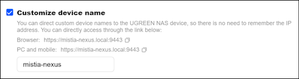
   In the `Portal settings` tab, configure the following:
   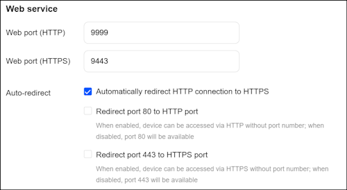

3. Open `Control Panel` >> `Terminal`
   Configure the following:
   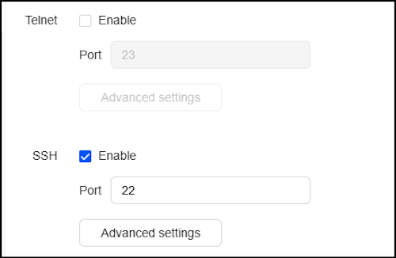
   Open `Advance settings` and configure the following storage pools:
   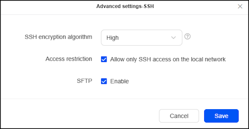

4. Open `Control Panel` >> `Network`
   In the `Network connection` tab, create the following `Virtual Bridge` on `LAN2`:
   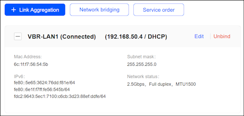

5. Copy the `Mac Address` of the `Virtual Bridge` and follow [DHCP Scope](#dhcp-scope) and [DHCP Reservation](#dhcp-reservation) guide

6. Open `Control Panel` >> `Network` and make sure that `VBR-LAN1` is assigned the IP of `92.168.50.4`

#### SSH Key

1. Open **Windows Terminal** and SSH into the NAS

   ```bash
   --8<-- "docs/content/.snippets/ssh.sh"
   ```

2. Download the `ssh-permission` script and service files
   Copy the whole code below and paste into the SSH terminal
   Paste in the [GitHub PAT](#github) when prompted

   ```bash
   read -sp 'Paste your GitHub PAT and press Enter: ' GITHUB_TOKEN
   printf "\n"
   sudo curl -sL -H "Authorization: Bearer ${GITHUB_TOKEN}" \
   "https://raw.githubusercontent.com/late4ever/Mistia-Labs/main/bootstrap/mistia-nexus-ssh-permission.sh" \
   -o /usr/local/bin/mistia-nexus-ssh-permission.sh

   sudo curl -sL -H "Authorization: Bearer ${GITHUB_TOKEN}" \
   "https://raw.githubusercontent.com/late4ever/Mistia-Labs/main/bootstrap/mistia-nexus-ssh-permission.service" \
   -o /etc/systemd/system/mistia-nexus-ssh-permission.service
   ```

3. Enable the SSH permission service

   ```bash
   sudo chmod +x /usr/local/bin/mistia-nexus-ssh-permission.sh
   sudo systemctl daemon-reload
   sudo systemctl enable mistia-nexus-ssh-permission.service
   sudo systemctl start mistia-nexus-ssh-permission.service
   ```

4. Check that the service is running

   ```bash
   sudo systemctl status mistia-nexus-ssh-permission.service
   ```

5. Copy the public key to NAS

   ```bash
   echo "ssh-ed25519 AAAAC3NzaC1lZDI1NTE5AAAAIGqAfflniXB7tAWGZ5ttgR+sTj90S4bCJKK4H3O1hPP9" >> ~/.ssh/authorized_keys
   chmod 600 ~/.ssh/authorized_keys
   exit
   ```

6. Now try to SSH into the NAS and Bitwarden should handle the authorisation

   ```bash
   --8<-- "docs/content/.snippets/ssh.sh"
   ```

   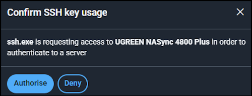

#### Storage Setup

1. Open `Storage` >> `Storage`
   In the `Storage pool & volume` tab, create the following:
   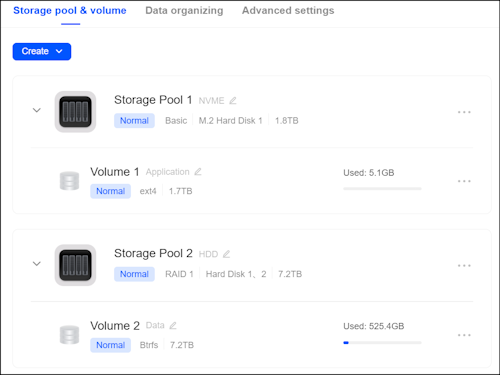

2. Open `Files` >> `Shared Folder`
   Create the following `Shared Folder`:
   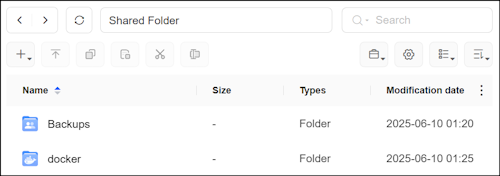

!!! danger "Folder Access"
    Only allow `late4ever` access.

#### Application Setup

1. Open `App Center` and install `Docker`

### :material-router-wireless: Router

#### DHCP Scope

1. Open the Router web interface and go to `LAN` >> `DHCP Server`

2. Configure the following `IP Pool Address` range:
   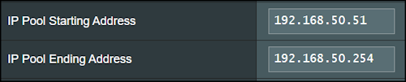

#### DHCP Reservation

1. Open the Router web interface and go to `LAN` >> `DHCP Server`

2. Create a `DHCP Reservation` for `UGREEN NASync` at `192.168.50.4`
   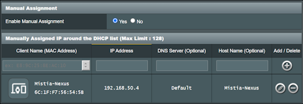

#### DNS Server

!!! danger "DNS Server Setting"
    Only configure this when the AdGuard Home service is running.

1. Open the Router web interface and go to `LAN` >> `DHCP Server`

2. Configure the following DNS Server setting:
   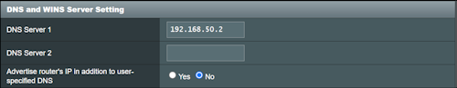

## 🚀 Start Up Services

### 💻 Deploy Containers

1. SSH into the NAS

   ```bash
   --8<-- "docs/content/.snippets/ssh.sh"
   ```

2. Download the `setup.sh`
   Copy the whole code below and paste into the SSH terminal
   Paste in the [GitHub PAT](#github) when prompted

   ```bash
   read -sp 'Paste your GitHub PAT and press Enter: ' GITHUB_TOKEN
   printf "\n"
   curl -sL -H "Authorization: Bearer ${GITHUB_TOKEN}" \
   "https://raw.githubusercontent.com/late4ever/Mistia-Labs/main/bootstrap/mistia-nexus-setup.sh" \
   -o setup.sh
   chmod +x setup.sh
   ./setup.sh "${GITHUB_TOKEN}"
   ```

3. Exit the SSH session and log back in

   ```bash
   exit
   --8<-- "docs/content/.snippets/ssh.sh"
   ```

4. Verify repository clone

   ```bash
   cd /volume2/docker/mistia-nexus
   ls -la
   ```

5. Follow the individual services guide on `Application Secret`

      - [Adguard Home](../../services/adguard-home#application-secret)
      - [Caddy](../../services/caddy#application-secret)
      - [Portainer](../../services/portainer#application-secret)
      - [Duplicati](../../services/duplicati#application-secret)

6. Start up the containers

   ```bash
   ./scripts/start-all.sh
   ```

### 🔗 Configure DNS Sinkhole

1. Download the `macvlan-host` script and service files
   Copy the whole code below and paste into the SSH terminal
   Paste in the [GitHub PAT](#github) when prompted

   ```bash
   read -sp 'Paste your GitHub PAT and press Enter: ' GITHUB_TOKEN
   printf "\n"
   sudo curl -sL -H "Authorization: Bearer ${GITHUB_TOKEN}" \
   "https://raw.githubusercontent.com/late4ever/Mistia-Labs/main/bootstrap/mistia-nexus-macvlan-host.sh" \
   -o /usr/local/bin/mistia-nexus-macvlan-host.sh

   sudo curl -sL -H "Authorization: Bearer ${GITHUB_TOKEN}" \
   "https://raw.githubusercontent.com/late4ever/Mistia-Labs/main/bootstrap/mistia-nexus-macvlan-host.service" \
   -o /etc/systemd/system/mistia-nexus-macvlan-host.service
   ```

2. Enable the `mistia-nexus-macvlan-host` service

   ```bash
   sudo chmod +x /usr/local/bin/mistia-nexus-macvlan-host.sh
   sudo systemctl daemon-reload
   sudo systemctl enable mistia-nexus-macvlan-host.service
   sudo systemctl start mistia-nexus-macvlan-host.service
   ```

3. Check that the service is running

   ```bash
   sudo systemctl status mistia-nexus-macvlan-host.service
   ```

4. Follow this [guide](#dns-server) to set up network-wide DNS filtering

## 🎉 Deployment Complete

- **🔒 Secure HTTPS access** to all services via Caddy reverse proxy
- **🛡️ Network-wide DNS filtering** via AdGuard Home
- **💾 Automated encrypted backups** via Duplicati
- **🐳 Docker management interface** via Portainer
- **📚 Complete documentation** via MkDocs

### 🔄 Next Steps

Follow the individual services guide on `Initial Setup`

- [AdGuard Home](../../services/adguard-home#initial-setup)
- [Caddy](../../services/caddy#initial-setup)
- [Portainer](../../services/portainer#initial-setup)
- [Duplicati](../../services/duplicati#initial-setup)
