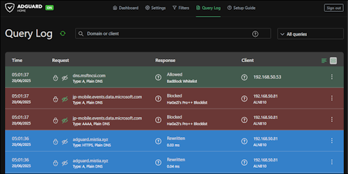
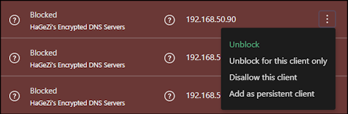
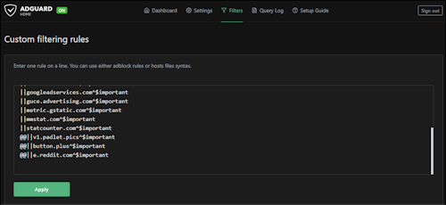

# 🛠️ :simple-adguard:{ .adguard } DNS Troubleshooting

!!! abstract "Overview"
    This guide outlines the procedure for investigating and unblocking a website that you suspect is being blocked by AdGuard Home.

## 🤔 A Website is Blocked

You attempt to navigate to a website (e.g., `example.com`), but the page fails to load, and you suspect AdGuard's filtering is the cause. The goal is to check the logs, confirm the block, and unblock the domain if it is safe.

### ▶️ Investigate and Unblock

#### 1. Access the Query Log

First, you need to log into the AdGuard Home web interface.

- **URL**: [https://adguard.mistia.xyz](https://adguard.mistia.xyz)
- Navigate to the **Query Log** section from the main menu.

#### 2. Filter the Logs

The Query Log shows every DNS request made by your clients. You can filter this list to quickly find the request you're interested in.

##### Option A: Filter by Client

This is the most effective method if you know the IP address of the device you were using when the site was blocked.

1. In the **Clients** filter dropdown at the top of the page, select the IP address or name of your device (e.g., `192.168.1.100`).
2. Look through the recent requests from this client. Blocked requests are typically highlighted in red or orange.

##### Option B: Filter by Domain

If you know the exact domain that was blocked, you can search for it directly.

1. In the **Search** bar at the top of the page, type the domain name (e.g., `example.com`).
2. The log will update to show only requests matching that domain.

#### 3. Identify and Unblock

Once you've located the blocked request in the log:

1. **Confirm the Block**: The entry will be clearly marked as "Blocked" and will often show which filter list caused the block (e.g., "Blocked by AdGuard DNS filter").
2. **Verify Safety**: Before proceeding, take a moment to consider if the domain is legitimate. If it looks suspicious or is from an unknown source, it may have been blocked for a good reason (e.g., malware, tracking).
3. **Unblock the Domain**: If you are confident the domain is safe, click the **Unblock** button next to the log entry.

  

This action adds the domain to your personal "Allow List" and will prevent AdGuard from blocking it in the future.

#### 4. Test Your Access

- Clear your device's browser cache or DNS cache.
- Try to access the website again. It should now load correctly.

### ↩️ Re-blocking a Domain

If you unblock a domain and later decide it was a mistake, you can easily remove it from your custom rules to re-enable blocking for it.

1. **Navigate to Custom Rules**: In the AdGuard Home UI, go to `Filters` >> `Custom filtering rules`.
2. **Find the Rule**: Look for the entry corresponding to the domain you unblocked. It will look like `@@||example.com^`. The `@@` prefix indicates it's an exception (allow) rule.
3. **Delete the Rule**: Click the trash can icon next to the rule to delete it.
4. **Apply Changes**: Click the "Apply" button to save your changes.

AdGuard will now resume blocking this domain based on your configured filter lists.
