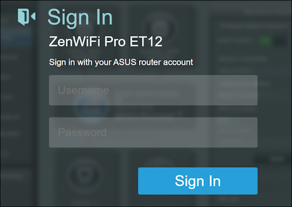
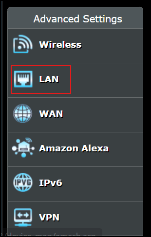
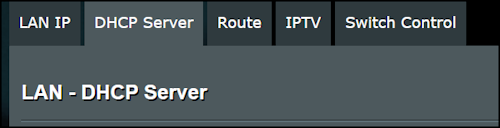
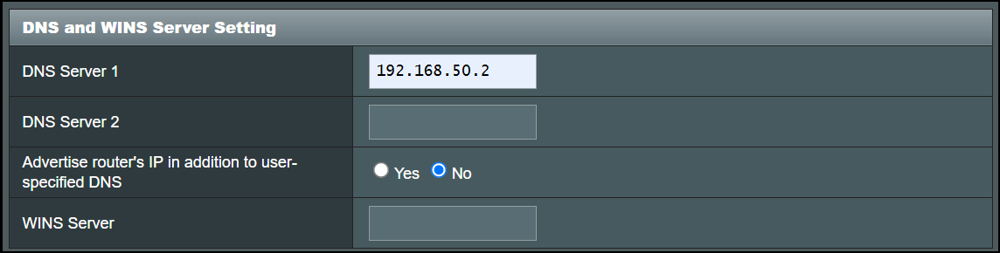
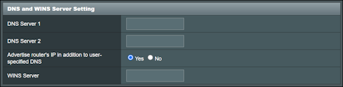

# 🌐 Internet Troubleshooting

!!! abstract "Overview"
    This guide outlines the procedure for investigating why the Internet is down.

## :simple-adguard:{ .adguard } Remove AdGuard Home DNS

1. Go to [https://192.168.50.1:8443](https://192.168.50.1:8443) on a device that is connected to our LAN or Wifi

    

2. Login using `Bitwarden` search for `Asus ET12` and use this credential to login

3. On the left-hand menu, select `LAN`

    

4. Select the `DHCP Server` tab

    

5. Scroll down to the `DNS and WINS Server Setting`

    

6. Update the values:
      - **DNS Server 1:** Clear any values
      - **DNS Server 2:** Clear any values
      - **Advertise router's IP in addition to user-specified DNS:** `Yes`
      - **WINS Server:** Clear any values

    

7. Click `Apply` at the bottom

8. If the internet is not resumed, call `My Republic` at `+65 6717 1680`, daily from 9 am to 2 am. For Fibre broadband issues, press 2 and then 4
